#+TITLE: Biomedical Databases Notes
#+AUTHOR: Francesco Codice' - Lectures of professor Turina

* Introduction

*Information flow*
#+attr_org: :width 650px
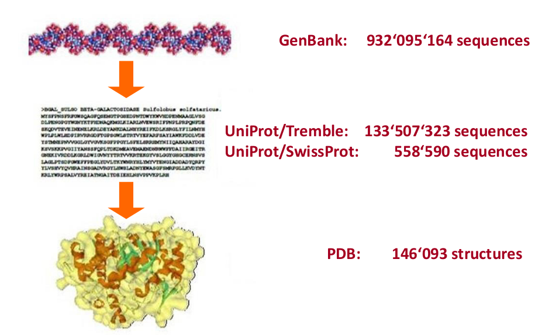

*Type of data* :
- *Primary data* (experimental results):
	- Genomes
	- Protein Sequences
	- Protein Structures Interactions
- *Secondary data* (derived info)
	- Protein folds
	- Protein families
	- Genome comparisations

*Annotation/Curation* :
- *Raw Data* : Protein sequence only
- *Annotated Data* : Protein sequence with function, localization, expression info, links etc.
	The annotation can be : /Manual/ or /Automatic/

*Common problems* :
- Quality check : if error enter a database they tend to propagate into other databases
	they are difficult to estirpate.
- Lack of standardization : lack of schema and lack of common nomenclature
- Integration : is important to integrate more databases. By fusion(uniprot) or by links.

*Main Bioinformatics databases*\\
- Uniprot: A comprehensive resource for protein sequence and functional annotation.
- Ensembl: Genome browser, API and database, providing access to reference genome annotation
- PDBe: The European resource for the collection, organisation and dissemination
  of 3D structural data (from PDB).
- InterPro : A databse for the classification of proteins into families, domains
  and conserved sites.

** Database introduction
A database is a large structured set of persistent data, usually in
computer-readable form

*Database terminology*
- /Table/ : A collection of closely related columns. A table consists of rows each of which shares the same columns but vary in the column values.
- /Record/ : A record is a collection of fields, possibly of different data
  types, typically in a fixed number and sequence
- /Key/ : A Key is a data item that exclusively identifies a record. In other
  words, key is a set of column(s) that is used to uniquely identify the record
  in a table
- /Field/ : A database field is a single piece of information from a record.

*DBMS*\\
DBMS software primarily functions as an interface between the end user and the
database, simultaneously managing the data, the database engine, and the
database schema in order to facilitate the organization and manipulation of data
Allows the user to:
- Access data
- Manipulate data
- Preserve the integrity
- Deal with security

*DBMS Models*:
- Flat file
- Hierical Models
- Relational Model
- Object-Oriented Model

** Relational Model
- Schema : logical structure of the data. /Intensional/ part
- Instance : is the set of actual data. /Extensional/ part

*How to store a Schema*\\
- Flat file – simple and available to all
- XML – eXtensible Markup Language (Markups instruct the software displaying the
  text)
- ASN.1 – Abstract Syntax Notation One (NCBI uses ASN.1 for data storage and
  retrieval)

* Pubmed
The National Center for Biotechnology Information (NCBI)(_www.ncbi.nlm.nih.gov_)
Created in 1988 as a part of the National Library of Medicine (NLM) at the
National Institute of Health (NIH).

*PubMed sections*\\
- PubMed free Medline
- PubMed Central : full text online access
- MeSH database (Medial Subject Headings) : controlled vocabulary thesaurus

*Why databases search is important?*\\
- The scientific literature increases by 2000 pages every minute.
- It would take 5 years to read the new scientific literature produced in 1 day.
$\rightarrow$ Search engines play an essential role for picking out the right articles

** Quering
*How to search?*\\
- *by Author* : name and initials with ['author'] tag (e.g. 'lesk am')
- *by Subject* : put the keyboard in search field ('e.g. 'evolution')
- *by Journal* : put the name of the journal with ['journal'] tag

PubMed uses *Automatic Term Mapping* : for any terms entered without a qualifier are looked
up against the following translation tables and indexes in a distinct order
1. MeSH Translation Table (terms like diseases, phenomena etc.)
2. Journal Translation Table
3. Author Index

It performs a translation and build the database query automatically

_Example_
Search: lesk am evolution
#+BEGIN_SRC
lesk am[Author] AND ("biological evolution"[MeSH Terms] OR ("biological"[All Fields]
AND "evolution"[All Fields]) OR "biological evolution"[All Fields] OR "evolution"[All Fields]
OR "evolution s"[All Fields] OR "evolutional"[All Fields] OR "evolutions"[All Fields]
OR "evolutive"[All Fields] OR "evolutivity"[All Fields])
#+END_SRC

For any database we usually have table that list all the possible /search fields/
#+CAPTION: Field Description Page of PubMed
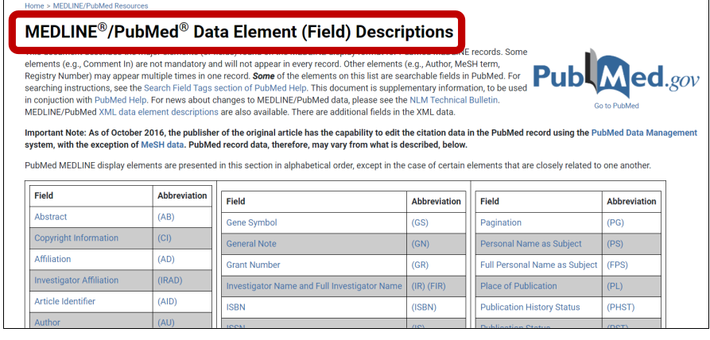

*** MeSH
 MeSH vocabulary is divided into four types of terms. The main ones are the
 "headings" (also known as MeSH headings or descriptors[2]), which describe the
 subject of each article (e.g., "Body Weight", "Brain Edema" or "Critical Care
 Nursing").

- Search MeSH db with a keyword
- click on the MeSH term, look at “Related information" and search in Pubmed
- for restricting use "Major Topics"

In addition to the descriptor hierarchy, MeSH contains a small number of standard
/qualifiers/ (also known as subheadings), which can be added to descriptors to narrow
down the topic. For example, "Measles" is a descriptor and "epidemiology" is a
qualifier; "Measles/epidemiology" describes the subheading of epidemiological
articles about Measles. The "epidemiology" qualifier can be added to all other
disease descriptors. Not all descriptor/qualifier combinations are allowed since some
of them may be meaningless. In all there are 83 different qualifiers.

*** Api access
Entrez Direct (EDirect) provides access to the NCBI's suite of interconnected databases
(pubblications, sequences, structues, genes, variations, expressions, etc.) from a
UNIX terminal windows.

*Entrez Dirext Functions*\\
- *esearch* : performs a new Entrex search using terms in indexed fields
- *efetch* : downloads records or reports in a designated format
- *xtract* : converts EDirect XML output into a table of data values
- *epost* : uploads unique indentifiers (UIDs) or sequence accession numbers

** Exercises
*** Exercise 1
- *Question* : Within PubMed, search for articles which contain as "Text Word"
  "circadian rhythms" and either "cortisol" or "melatonin". Limit your search to
  articles which contain "humans" as a MeSH term, and exclude all Review
  articles. How many entries have you found?
- *Answer*
  953 entries are present for this query.
  The query used is the following
  #+BEGIN_SRC
    "circadian rhythms "[Text Word] AND (melatonin[Text Word] OR cortisol[Text Word]) AND "Humans"[MeSH Terms] NOT "review"[Publication Type]
  #+END_SRC

*** Exercise 2
- *Question* : Find all articles with first or last author “Smith”, which have
  been "nih funded" (hint: check in "Filter"), whose major topics is “Alzheimer
  disease”, dealing in particular with the diagnosis of such disease. How many
  articles have you found ?

- *Answer*

  #+BEGIN_SRC
    ((Smith[Author - Last] OR Smith[Author - First]) AND "nih funded"[Filter] AND "Alzheimer disease/Diagnosis"[MeSH Major Topic])
  #+END_SRC

* UniProt
UniProt is a freely accessible database of protein sequence and functional information, many entries being derived from genome sequencing projects. It contains a large amount of information about the biological function of proteins derived from the research literature

A comprehensive resource for protein sequence and functional annotation.

It is a consortium
+ *SIB* (Swiss Institute of Bioinformatics) : /UniProtKB/(UniProt Knowledgebase) _/Swiss-Prot/_
+ *EBI* (European Bioinformatics Institute) : UniProtKB _/TrEMBL/_ and _/UniParc/_ (UniProt Archive)
+ *PIR* (Protein Information Resource) : _/UniRef/_ (UniProt Reference Cluter)

*UniProt Data Flow*
EMBL(Cds) $\rightarrow_{\text{(Translation)(Automatic Annotation)}}$  $\rightarrow$ TrEMBL(Protein) $\rightarrow_{\text{(Manual Curation)}}$ Swiss-Prot(Protein)

#+CAPTION: UniProt Scheme
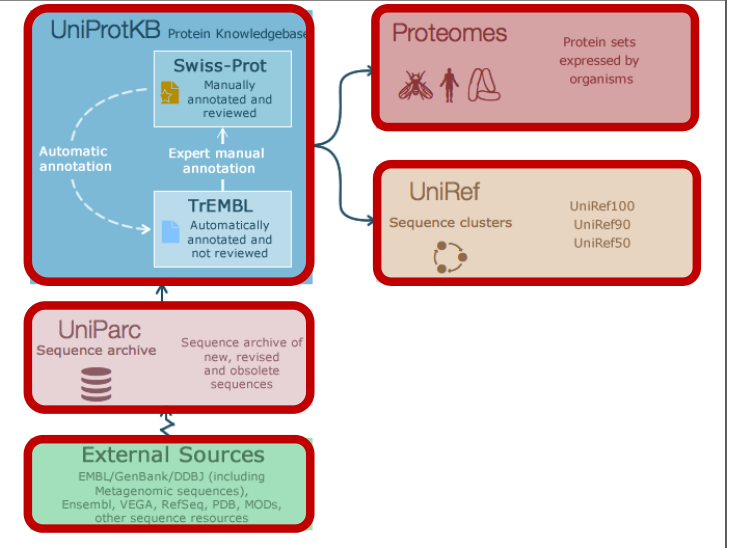

I very important understand which UniProt Release we are using.

** Manual Curation* (it is a process of _validation_)
/Manual curation/ consists of a critical review of experimental and predicted data
for each protein as well as manual verification of each protein sequence.
Curation methods applied to UniProtKB/Swiss-Prot include
- manual extraction and structuring of information from the literature
- manual verification of results from computational analyses
- mining and integration of large-scale data sets
- continuous updating as new information becomes available.

*Discrepancies between sequence reports* are identified, with underlying causes such as:
- alternative splicing
- natural variations
- frameshifts
- incorrect initiation sites
- incorrect exon boundaries
- unidentified conflicts
- erroneous gene prediction

*Comparison with homologous sequences* can be used to identify sequence errors
and their causes. Each protein in Swiss-Prot should be as complete and correct as possible.

*Annotations*\\
- Biological Process
- Molecular Function : Activity or task performed
- Cellular Component : Where is the protein located

** Gene ontology
An ontology is a formal representation of a body of knowledge within a given domain.
Ontologies usually consist of a set of classes (or terms or concepts) with relations that
operate between them.

The Gene Ontology (GO) describes our knowledge of the biological domain with respect to three
aspects:
- /Molecular function/ : Molecular-level activities performed by gene products. Molecular
  function terms describe activities that occur at the molecular level, such as “catalysis” or
  “transport”. GO molecular function terms represent activities rather than the entities
  (molecules or complexes) that perform the actions, and do not specify where, when, or in
  what context the action takes place. Molecular functions generally correspond to activities
  that can be performed by individual gene products (i.e. a protein or RNA).

- /Cellular Component/ : The locations relative to cellular structures in which a gene product
  performs a function, either cellular compartments (e.g., mitochondrion), or stable
  macromolecular complexes of which they are parts (e.g., the ribosome).

- /Biological Process/ : The larger processes, or ‘biological programs’ accomplished by
  multiple molecular activities. Examples of broad biological process terms are DNA repair or
  signal transduction. Examples of more specific terms are pyrimidine nucleobase biosynthetic
  process or glucose transmembrane transport.

*** GO Classes
GO classes (or GO terms) are composed of a definition, a label, a unique identifier, and
several other elements.

 _Required fields_\\
- Unique Identifier (ID)
- Term Human Readable name
- Aspect : which of the three ontologies does this entity belong to
- Definition: textual definition of what the terms represent
- Relationship with other terms

_Optional elements_\\
- Secondary ID
- Synonyms
- Comments
- DB cross reference

*** Go domains and graph
The three GO domains (cellular component, biological process, and molecular function) are each
 represented by a separate root ontology term. All terms in a domain can trace their parentage
 to a root term, although there may be numerous different paths via varying numbers of
 intermediary terms to a ontology root. The three root nodes are unrelated and do not have a
 common parent node, and hence GO is three ontologies.
[[file:~/bioinformatics-notes/Bioinformatics_Lab1/Functional Annotation/ggaagaga_2020-12-20_15-42-29.gif]]

*** Go annotations
A GO annotation is a statement about the function of a particular gene. GO annotations are
created by associating a gene or gene product with a GO term.

Together, these statements comprise a “snapshot” of current biological knowledge. Hence, GO
annotations capture statements about how a gene functions at the molecular level, where in the
cell it functions, and what biological processes (pathways, programs) it helps to carry out.

There are four pieces of information that uniquely identify a GO annotation. Although there
are additional components a curator can use to indicate more information, including qualifiers
and annotation extensions, at the very minimum an annotation consists of:

- Gene product (may be a protein, RNA, etc.)
- GO term
- Reference
- Evidence

*** Go Evidence
We can have different level of evidence with the following codes
- Inferred from Experiment (EXP)
- Inferred from Direct Assay (IDA)
- Inferred from Physical Interaction (IPI)
- Inferred from Mutant Phenotype (IMP)
- Inferred from Genetic Interaction (IGI)
- Inferred from Expression Pattern (IEP)

** UniProt Annotation System

*Enzyme Classification* (6 CLASSES)
| EC Class | Reaction Type   |
|        1 | Oxidoreductases |
|        2 | Trannsferases   |
|        3 | Hydrolases      |
|        4 | Lyases          |
|        5 | Isomerases      |
|        6 | Ligases         |

This is a tree like classification. It is used a 4 numbers code to annotate an enzyme.

#+CAPTION: Annotation of Enzyme
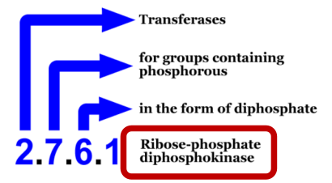

- *UniProtKB/TrEMBL*
  - Redundant
	- 1 entry for each translated ENA entry
	- Computationally analyzed
	- Automatically annotated
	- Unreviewed

		*ARBA (Association rule based annotation)* : uses rule mining techniques to generate
		annotation models, based on the InterPro classification.

- *UniProtKB/SwissProt*
  - Non-Redundant
	- 1 entry for each protein
	- Curator analyzed
	- High-quality manually annotated
	- Reviewed
		It is safe to assume that manual annotations are more reliable than automatic ones.
		*UniRule*: maintains a set of manually established annotation rules.

		*InterPro* is an effort to integrate all the main databases about protein classification.

#+CAPTION: Annotation Sources used by curators
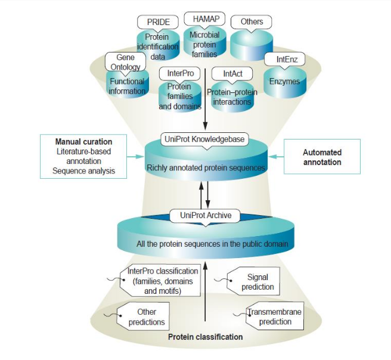

*** Evidence And Conlcusion Ontology
An *evidence* is described by a type (mandatory evidence type), represented by a code from
the Evidence and Conclusion Onthology(ECO) and ,if available, the source of the information,
which is usually a database record.

*Example*
- Evidence type without source{type}
	#+BEGIN_SRC
{ECO: 0000305}
{ECO: 000250}
{ECO: 000255}
	#+END_SRC

- Evidence type with source {type|source}
	#+BEGIN_SRC
{ECO: 0000305|Pubmed:2435555}
{ECO: 000250|UniProtKB:p11497}
	#+END_SRC

#+CAPTION: Annotation format/style on Uniprot

*** Annotations categories
- Function
- Names & Taxonomy
- Subcellular location
- Pathology & Biotech
- Post Translation Modifications / Processing
- Expression
- Interactions
- Structure
- Family and Domains
- Sequences
- Similar Proteins
- Cross-referenes
- Entry informations

*** Automatic Annotation
#+attr_org: :width 750px
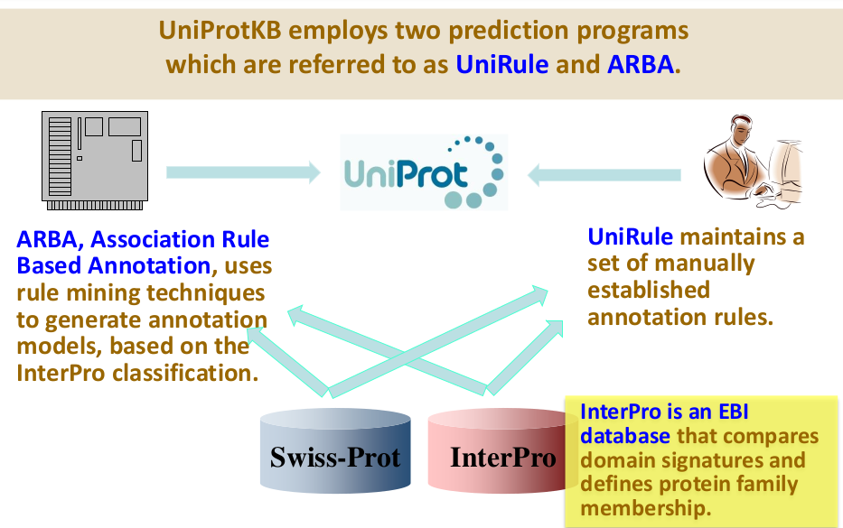

*Problems*\\
Electronic Annotation follows the principle that proteins with similar sequences
and similar structures frequently carry out similar functions.

But protein sequence or structure similarity alone does not necessarily equate
to cellular or molecular functional similarity.

*** Annotation Score
The annotation score provides a heuristic measure of the annotation content of a
UniProtKB entry or proteome. This score cannot be used as a measure of the
accuracy of the annotation as we cannot define the 'correct annotation' for any
given protein.

The annotation score is computed in the following way:

- Different UniProtKB annotation types (e.g. protein names, gene names, functional annotations (comments) and sequence annotations (features), GO annotations, cross-references) are scored either by presence or by number of occurrences.

   Annotations with experimental evidence score higher than equivalent
   predicted/inferred annotations, thereby favoring expert literature-based
   curation over automatic annotation.

- The score of an individual entry is the sum of the scores of its annotations.

- The score of a proteome is the sum of the scores of the entries that are part of the proteome.

** Interpro Database
InterPro is a database of _protein families, domains and functional sites_ in which identifiable features found in known proteins can be applied to new protein sequences in order to functionally characterise them.

The contents of InterPro consist of diagnostic signatures and the proteins that
they significantly match. The _signatures consist of models_ (/simple types,
such as regular expressions or more complex ones, such as Hidden Markov models/)
which describe /protein families/, /domains/ or /sites/.

Models are built from the amino acid sequences of known families or domains and
they are subsequently used to search unknown sequences (such as those arising
from novel genome sequencing) in order to classify them.

- In InterPro, patterns, profiles, fingerprints and HMMs from a number of
  different databases are brought together into a single searchable resource.

#+attr_org: :width 550px

** Uniprot Entry
Annotations of a UniProtKB entry are structured into the following sections:
- Function
- Names & Taxonomy
- Subcellular location
- Pathology and Biotech
- PTM / Processing
- Expression
- Interaction
- Structure
- Family and Domains
- Sequence(s)
- Cross-references
- Publications
- Entry information
- Miscellaneous
- Similar Proteins

** UniParc
UniProt Archive (UniParc): An archive for tracking protein sequences
- Comprehensive : contains most of the publicly available protein sequences in
  the world
- Non-redundant : merges identical sequence strings, each unique sequence is
  given a stable and unique identifier (UPI)
- Traceable : Versioned, with ‘active’ and ‘obsolete’ status tags
- Concise : no annotations

** UniRef
The /UniProt Reference Clusters (UniRef)/ provide clustered sets of sequences from the UniProt Knowledgebase (including isoforms) and selected UniParc records in order to obtain complete coverage of the sequence space at several resolutions while hiding redundant sequences (but not their descriptions) from view.

*UniRef Cluters*\\
- /UniRef50/ : UniRef50 is generated by clustering UniRef90 seed sequences that
  have at least 50% sequence identity.

- /UniRef90/ : UniRef90 is generated by clustering UniRef100 seed sequences that
  have at least 90% sequence identity.

- /UniRef100/ : UniRef100 contains all UniProt Knowledgebase records plus selected UniParc records (see below). It is generated by clustering identical sequences and subfragments.

#+attr_org: :width 350px
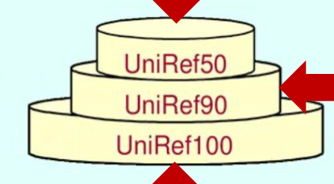

*** UniRef Seed
- A UniRef seed is the sequence that has been used as the template to recruit
  other sequences by the clustering algorithm. The seed sequence is the longest
  member of a cluster.
- However, the longest sequence is not always the most informative one. There is
  often more biologically relevant information (name, function,
  cross-references) available on other cluster members. Therefore, in addition,
  a /representative sequence is chosen for each cluster/.

** Proteomes
A proteome is the set of proteins thought to be expressed by an organism.
UniProt provides proteomes for species with completely sequenced genomes

- /Reference Proteomes/ : Some proteomes have been (manually and
  algorithmically) selected as reference proteomes. They cover well-studied
  model organisms and other organisms of interest for biomedical research and
  phylogeny

#+attr_org: :width 650px
#+CAPTION: Proteome Complexity
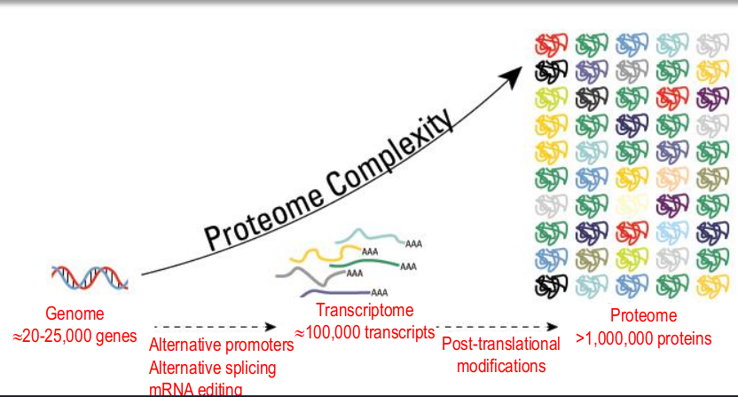

*** Human Proteome
September 2008 First draft of the complete human proteome available in
UniProtKB/ Swiss-Prot. Gene prediction algorithms, plus the existing transcript
and protein information, have enabled the identification of most exons in a
genome.

** Protein Classification
*Protein Family*\\
A protein family is a group of proteins that share a common evolutionary origin,
reflected by their related functions and similarities in sequence or structure.
Protein families are often arranged into hierarchies.

#+CAPTION: Protein families
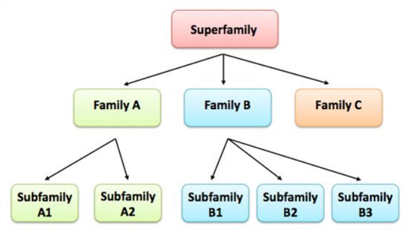

#+CAPTION: Protein families example. The level at which we can place determines the amount of functional information we can infer.

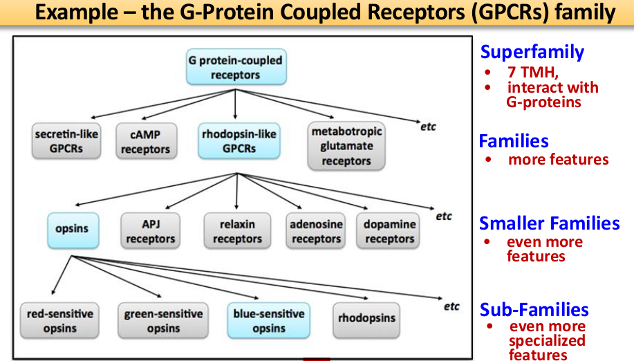

*Protein Domains*

A protein domain is a conserved part of a given protein sequence and tertiary structure that
can evolve, function, and exist independently of the rest of the protein chain. Each domain

Domains have been described as units of:
- compact structure
- function and evolution
- folding

Each of these definition is valid and will often overlap. The identification of
domains that occur within proteins can provide insights into their function.

*Protein Signatures*
Signatures: mathematical models constructed from MSA.
They are often a very sensitive way of identifying protein function.
#+CAPTION: Protein Signatures
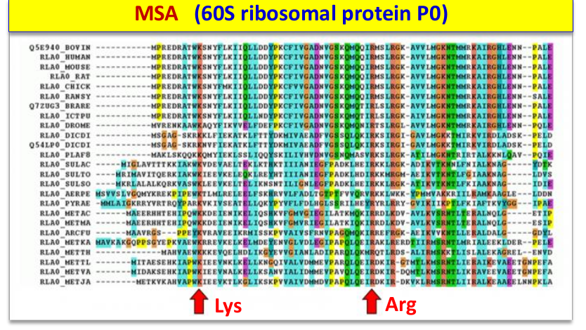

*Protein Profile*

*** InterPro database
In InterPro, patterns, profiles, fingerprints and HMMs from a number of different databases
are brought together into a single searchable resource.
#+CAPTION: Interpro scheme
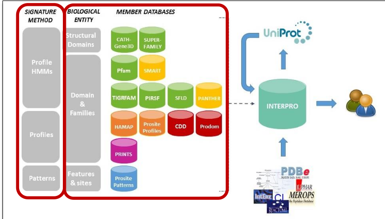

*** PFam Database
#+CAPTION: Pfam
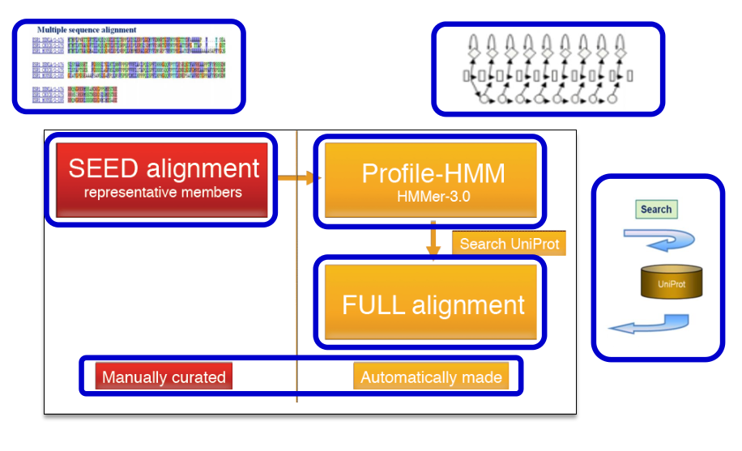

** Exercises
*** Exercise 1
- *Question* : Write down a single query which will retrieve within UniProt all proteins, labelled as proteases in the CC function field, from human and mouse, excluding those labelled as "cysteine proteases" in the same field.

- *Answer*
#+BEIN_SRC
annotation:(type:function protease) (organism:"Homo sapiens (Human) [9606]" OR organism:"Mus musculus (Mouse) [10090]") NOT annotation:(type:function "cysteine protease")
#+END_SRC

*** Exercise 2
- *Question*
Do the same as above, but using the EC codes for "proteases" and for "cysteine proteases".

- *Answer*
 #+BEGIN_SRC
ec:3.4.*.* NOT ec:3.4.22.* (organism:"Homo sapiens (Human) [9606]" OR organism:"Mus musculus (Mouse) [10090]")
 #+END_SRC

*** Exercise 3
- *Question* :
  Which protein is involved in the human sma2 disease ? (insert UniProt code)

- *Answer*
  #+BEGIN_SRC
  annotation:(type:disease sma2) AND organism:"Homo sapiens (Human) [9606]"
  #+END_SRC

  Q16637 (https://www.uniprot.org/uniprot/Q16637)

*** Exercise 4
- *Question*
    - Which natural variant reduces in the sma2 and sma3 disease the binding of such protein to RPP20/POP7?  Which is the corresponding dbSNP code? (insert UniProt variant code and dbSNP code)
    - On which evidence is the above piece of information based? Which is the
      UniProt code for the evidence type?
- *Answer*
    Search in pathology and biotech sections
  - _Natural variant VAR_005618_   _dbSNP:rs76871093_
  - Experimental ,  ECO:0000269

*** Exercise 5
- *Question*

- *Answer*
  UP000005640 <- Proteome id
  - 75,777 <- Proteins present
  - 602 <- Uncertain proteins
    #+BEGIN_SRC
    existence:"Uncertain [5]" AND organism:"Homo sapiens (Human) [9606]" AND proteome:up000005640
    #+END_SRC

* ENSEMBL
Ensembl is a joint project between the European Bioinformatics Institute and the
Wellcome Trust Sanger Institute, launched in 1999 in response to the imminent
completion of the Human Genome Project.

- The Ensembl project team developed new software pipelines to automatically
  generate evidence-based annotation of genome sequences.
- The Ensembl project has expanded from the curation of the human genome to
  embrace more than 50 vertebrate species, and several hundreds non vertebrates
  species.
- Generating the annotation is just the start. Ensembl provides several means of
  data access, the foremost of which is a highly customisable, interactive
  website.

** ENSEMBL Features
- The gene set
  + Splice variant, proteins, noncoding RNA
- Comparative analysis
  + Whole genome alignments, protein trees
- Variation and regulation
  + Variants (SNPs, InDels, CNVs)
- BioMart (data export)
- Programmatic access via Perl-API, MySQL
- Data and code are open source

** Human Genome
The human genome consists of three billion base pairs, which code for approximately /20,000–25,000/ genes.

- However the genome alone is of little use, unless the locations and relationships of individual genes can be identified. One option is manual annotation, whereby a team of scientists tries to locate genes using experimental data from scientific journals and public databases. However this is a slow, painstaking task.
- The alternative, known as automated annotation, is to use the power of computers to do the complex pattern-matching of protein to DNA.

#+attr_org: :width 550px
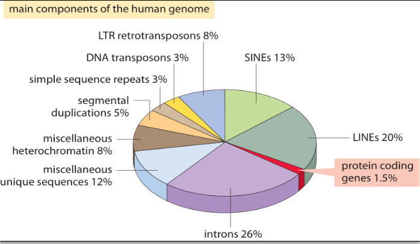

About 1.5% of the genome consists of the $\simeq 20,000$ protein-coding sequences which
are interspersed by the non coding introns ( $\simeq 26%$ ). Transposable Elements are
the largest fraction (40-50%) including for example Long Interspersed Nuclear
Elements (LINEs), and Short Interspersed Nuclear Elements (SINEs). Most
Transposable Elements are genomic remnants, which are currently defunct.

*Transcribed Human Genome*
#+attr_org: :width 550px
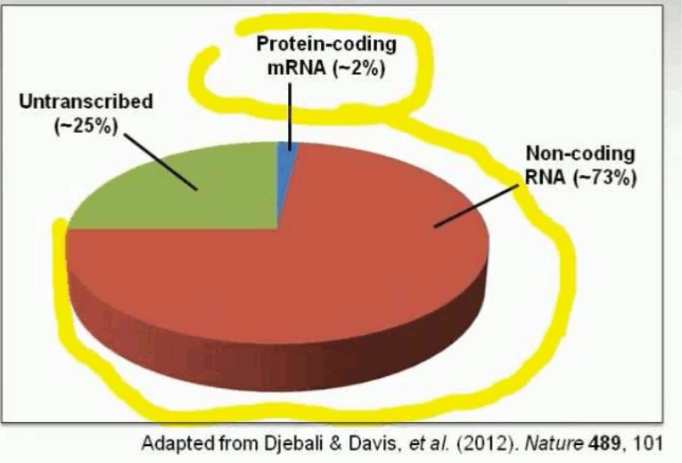

*** Gene Quantification
A comparison between the number of genes in an organism and a naïve estimate
based on the genome size divided by a constant factor of 1000bp/gene.

It is found that this crude rule of thumb, which works well for many bacteria
and archaea, fails for multicellular organisms.

#+attr_org: :width 450px
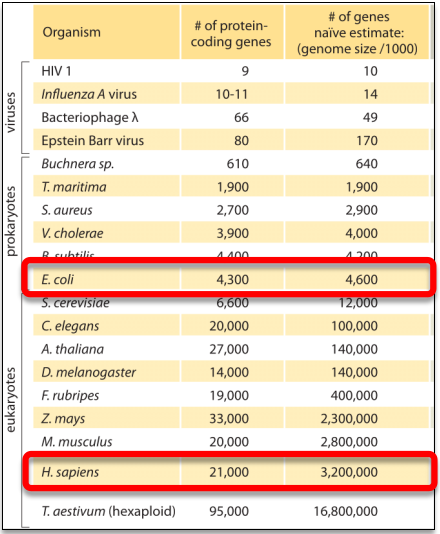

** Gene Prediction
#+attr_org: :width 550px
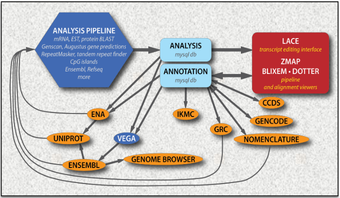

*Automatic Annotation*\\
Gene building all at once (whole genome) → «Ensembl»
- cDNA and protein alignments (from sequence DBs)
- RNAseq data
- Ab initio predictions (based on the genomic sequence, no experimental
  evidence)
- Gene predictions based on ESTs (ESTGenes)

*Manual Annotation*\\
Gene determination on a case-by-case by a curator →
- VEGA (VErtebrate Genome Annotation)
- Havana (Human And Vertebrate ANalysis and Annotation)

** Ensembl vs Havana

| ENSEBL               | Havana            |
|----------------------+-------------------|
| Automatic Annotation | Manual Annotation |
| Many Species(n=61)   | Fewer Species     |
| Genome-wide at once  | Gene by gene      |

When Havana and Ensembl predict the same transcript, basepair for basepair, the
transcripts are merged and coloured gold

- A protein is deposited into the /"Consensus CDS protein set"/ (CCDS set) if
  NCBI, UCSC, Havana, Ensembl have determined the same sequence.

** Glossary
*** Locating a gene

The cytogenetic location, a standardized way of describing a gene’s location on the chromosome, consists of a combination of numbers and letters and is made up of three components:

    Number or letter of the chromosome (1-23, X or Y)

    Arm of the chromosome (p or q)

    Position of the gene on the arm (cytogenetic bands). The position is dependent on the light and dark bands that appear on the chromosome when stained and is expressed as a two-digit number (one digit represents region and one represents band). Sometimes the digits are followed by a decimal point and one or more digits. These additional digits represent the distance from the centromere (increasing numeric value indicates farther distance from centromere). “Cen”, “ter”, and “tel” are also used to describe the position of the gene on the arm.

Cen – close to the centromere
Ter (terminus) – close to end of either the p or q arms
Tel (telomere) – close to end of either the p or q arms

Example
Gene: Anaplastic lymphoma kinase receptor
Chromosomal location: 2p23
Location description: chromosome 2, p arm, position 23

** Exercises
*** Exercise ENSEMBL
- *Question*\\
    The LCT gene product (lactase) has lactase activity. Mutations in this gene
    are associated with congenital lactase deficiency. Polymorphisms in this
    gene are associated with lactase persistence, in which intestinal lactase
    activity persists at childhood levels into adulthood.
  1) Which is the Ensembl code for this gene? How many transcripts are reported
     for this gene? Are they all protein coding? Are they coded on the forward
     or reverse strand?
  2) Which is the Ensembl code of the longest transcript? Which is its CCDS code
     ? And its Refseq codes ?
  3) Which are the chromosomal coordinates of this gene ? And its cytogenetic
     location ?
  4) Which is the protein sequence in the reference genome between positions 2: 135,829,587  and 2:135,829,598 ? Are there variants for these residues,
     which are annotated in Ensembl ? Which databases do they come from ? What
     are their amino acid positions, in the protein product from the LCT-201
     transcript ?

- *Answer*\\
  1) The Ensembl code is /ENSG00000115850/ . This gene has 2 transcripts.
     LCT-201 yes, LCT-202. Reverse strand for both.

  2) ENST00000264162.7 . CCDS2178 . NM_002299.4

  3) Chromosome 2: 135,787,850-135,837,184 . q21.3

  4) LCT-201, yes, dbSNP, 801, 817

* PDB
It is an archive of /experimentally determined/ 3-dimensional structures of biological
macro-molecules (Protein, nucleic acids, sugars).

The PDB is a key in areas of structural biology, such as structural genomics.
Most major scientific journals, and some funding agencies, now require
scientists to submit their structure data to the PDB.

*Content*
- /X-ray Crystallography/ (88%) : Strucure Factors data
- /NMR Spectroscopy/ (10%) : Restrains, Chemical Shifts
- /Electron Microscopy/ (1%) : Map in EMDB

#+CAPTION : PDB History
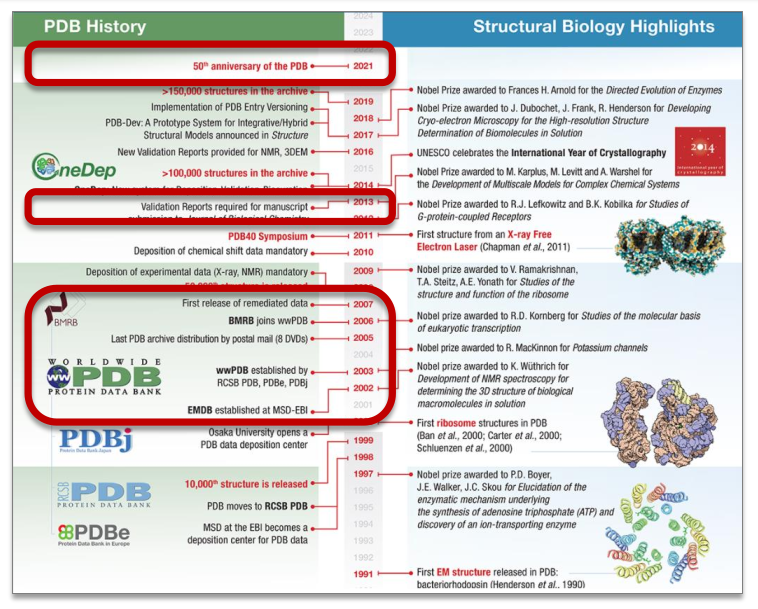

** Validation
*Validation side*\\
Method-specific Validation Task Forces have been convened to
collect recommendations and develop consensus on additional validation that
should be performed, and to identify software applications to perform validation
tasks. There are tools available for the validation of X-ray Crystallography, NMR and
Electron Microscopy data.

There are many metrics used to validate the quality of a protein structure in the PDB file.

*** B-Factor (Temperature Factor)
The /B-factor/ for each atom is given by: $B = 8 \pi^{2} U^{2}$
where $U^{2}$ is the /mean square displacement/ of the atom.

/Mean Square Displacement/ : It is the most common measure of the spatial extent
of random motion, and can be thought of as measuring the portion of the system
"explored" by the random walker.

Examples
if B-factor = 15 A -> mean square displacement $\simeq 0.44 A$
if B-factor = 60 A -> mean square displacement $\simeq 0.87 A$

*** Resolution
Resolution in X-ray crystallography: _the highest resolvable peak in the
diffraction pattern._ If the proteins in the crystal are not perfectly aligned,
but all slightly different, due to local flexibility or disorder, the
diffraction pattern will not show such fine information.

  High-resolution structures, with resolution values of 1 Å or so, are highly
  ordered and it is easy to see every atom in the electron density map.

  Lower resolution structures, with resolution of 3 Å or higher, show only the
  basic contours of the protein chain, and the atomic structure must be
  inferred. Most crystallographic-defined structures of proteins fall in between
  these two extremes.

  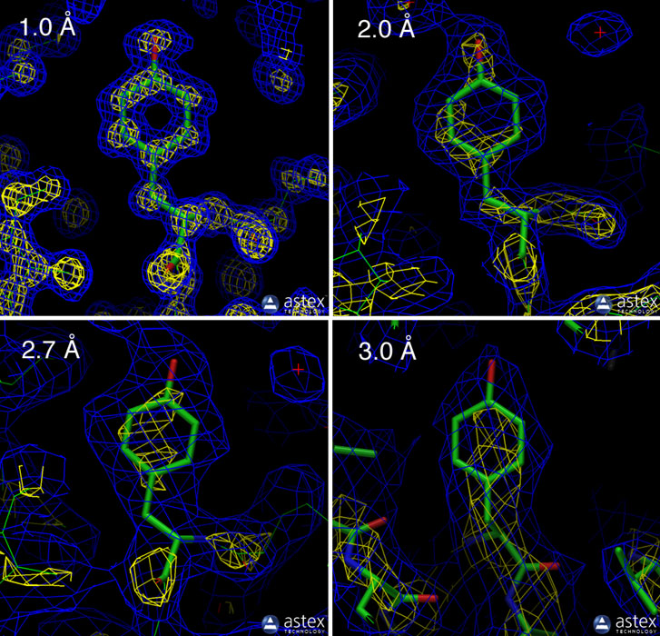

*** R-value (x-ray only)
/R-value/ is the measure of the quality of the atomic model obtained from the
 crystallographic data. When solving the structure of a protein, the researcher
 first builds an atomic model and then calculates a simulated diffraction
 pattern based on that model.

  The R-value measures how well the simulated diffraction pattern matches the
  experimentally-observed diffraction pattern.

  - A totally random set of atoms will give an R-value of about 0.63,
  - a perfect fit would have a value of 0.
  - Typical values are about 0.15-0.20.

*** R-free (x-ray only)
There is one potential problem with using R-values to assess the quality of a
  structure. The refinement process is often used to improve the atomic model of
  a given structure to make it fit better to the experimental data and improve
  the R-value. Unfortunately, this introduces bias into the process, since the
  atomic model is used along with the diffraction pattern to calculate the
  electron density.

  The use of the R-free value is a less biased way to look at this. Before refinement begins,
  about 10% of the experimental observations are removed from the data set. Then, refinement
  is performed using the remaining 90%. The R-free value is then calculated by seeing how well
  the model predicts the 10% that were not used in refinement.

*** RSRz (x-ray only) :
The real-space R-value (RSR) is a measure of the quality of fit between a part of
  an atomic model (in this case, one residue) and the data in real space (Jones et al., 1991).
  The RSR Z-score (RSRZ) is a normalisation of RSR specific to a residue type and a resolution
  bin (Kleywegt et al., 2004). RSRZ is calculated only for standard amino acids and
  nucleotides in protein, DNA and RNA chains.

*** Ramachandran Outliers (all methods)
A residue is considered to be a Ramachandran plot outlier if the combination of
  its φ and ψ torsion angles is unusual, as assessed by MolProbity (Chen et al.,
  2010). The Ramachandran outlier score for an entry is calculated as the
  percentage of Ramachandran outliers with respect to the total number of
  residues in the entry for which the outlier assessment is available.
- *Clashscore* (all methods): Atoms bumping into each other score
- *Sidechain Outlier* (all methods): Protein sidechains mostly adopt certain (combinations of) preferred
  torsion angle values (called rotamers or rotameric conformers), much like their backbone
  torsion angles (as assessed in the Ramachandran analysis). MolProbity considers the
  sidechain conformation of a residue to be an outlier if its set of torsion angles is not
  similar to any preferred combination. The sidechain outlier score is calculated as the
  percentage of residues with an unusual sidechain conformation with respect to the total
  number of residues for which the assessment is available.

*** Percentile Slider
The metrics shown in the "slider" graphic (see examples below) compare several important
global quality indicators for this structure with those of previously deposited PDB entries.
The comparison is carried out by calculation of the percentile rank, i.e. the percentage of
entries that are equal or poorer than this structure in terms of a quality indicator. The
global percentile ranks (black vertical boxes) are calculated with respect to all X-ray
structures available in the PDB archive
#+DOWNLOADED: file:///home/codicef/Pictures/validation.png @ 2020-12-05 15:46:08
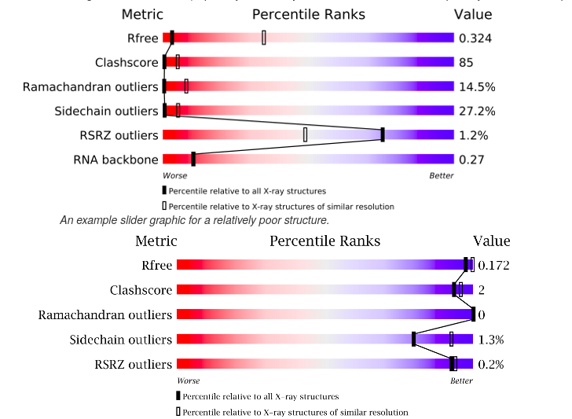

*Chain quality details graph*\\
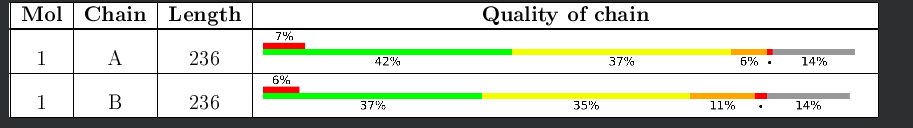

There may be green, yellow, orange and red portions in the lower bar for each chain,
indicating the fraction of residues that contain outliers for 0, 1, 2, ≥3 model-only
validation criteria, respectively. A grey segment indicates residues present in the sample but
not modelled in the final structure. If electron density outliers were present, there is an
additional red bar above the lower bar, indicating the fraction of residues that are RSRZ
outliers.

*NMR validation*\\
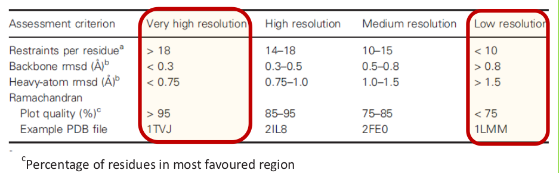

*Crio-electron microscopy*\\
From Neumann et al. 2018 : Recent advances in instrumentation and image-processing software
have resulted in a resolution revolution in cryo-electron microscopy .... However despite
technical progress and hundreds of structures determined so far, development of standards
assessing the agreement between the cryo-em map and the respective model as fallen behind.

** PDB File Format
The Protein Data Bank (pdb) file format is a textual file format describing the
three-dimensional structures of molecules held in the Protein Data Bank. The pdb
format accordingly provides for description and annotation of protein and
nucleic acid structures including atomic coordinates, secondary structure
assignments, as well as atomic connectivity. In addition experimental metadata
are stored.

- /HEADER/, /TITLE/ and /AUTHOR/ records provide information about the researchers who
  defined the structure; numerous other types of records are available to
  provide other types of information.
- /REMARK/ records can contain free-form annotation, but they also accommodate
  standardized information; for example, the REMARK 350 BIOMT records describe
  how to compute the coordinates of the experimentally observed multimer from
  those of the explicitly specified ones of a single repeating unit.
- /SEQRES/ records give the sequences of the three peptide chains (named A, B
  and C), which are very short in this example but usually span multiple lines.
- /ATOM/ records describe the coordinates of the atoms that are part of the
  protein.
   - /Atom serial number/
   - /Atom name/
   - /Residue name/
   - /Chain identifier/
   - /Residue sequence number/
  - the first three floating point numbers are its /x/, /y/ and /z/
    /coordinates/ and are in units of /Ångströms/.
  - The next three columns are the /occupancy/, /temperature factor/, and the
    /element name/, respectively.
- /HETATM/ records describe coordinates of hetero-atoms, that is those atoms which
    are not part of the protein molecule.

#+CAPTION : Example PDB file
#+BEGIN_SRC
HEADER    EXTRACELLULAR MATRIX                    22-JAN-98   1A3I
TITLE     X-RAY CRYSTALLOGRAPHIC DETERMINATION OF A COLLAGEN-LIKE
TITLE    2 PEPTIDE WITH THE REPEATING SEQUENCE (PRO-PRO-GLY)
...
EXPDTA    X-RAY DIFFRACTION
AUTHOR    R.Z.KRAMER,L.VITAGLIANO,J.BELLA,R.BERISIO,L.MAZZARELLA,
AUTHOR   2 B.BRODSKY,A.ZAGARI,H.M.BERMAN
...
REMARK 350 BIOMOLECULE: 1
REMARK 350 APPLY THE FOLLOWING TO CHAINS: A, B, C
REMARK 350   BIOMT1   1  1.000000  0.000000  0.000000        0.00000
REMARK 350   BIOMT2   1  0.000000  1.000000  0.000000        0.00000
...
SEQRES   1 A    9  PRO PRO GLY PRO PRO GLY PRO PRO GLY
SEQRES   1 B    6  PRO PRO GLY PRO PRO GLY
SEQRES   1 C    6  PRO PRO GLY PRO PRO GLY
...
ATOM      1  N   PRO A   1       8.316  21.206  21.530  1.00 17.44           N
ATOM      2  CA  PRO A   1       7.608  20.729  20.336  1.00 17.44           C
ATOM      3  C   PRO A   1       8.487  20.707  19.092  1.00 17.44           C
ATOM      4  O   PRO A   1       9.466  21.457  19.005  1.00 17.44           O
ATOM      5  CB  PRO A   1       6.460  21.723  20.211  1.00 22.26           C
...
HETATM  130  C   ACY   401       3.682  22.541  11.236  1.00 21.19           C
HETATM  131  O   ACY   401       2.807  23.097  10.553  1.00 21.19           O
HETATM  132  OXT ACY   401       4.306  23.101  12.291  1.00 21.19           O
...
#+END_SRC

* NCBI
*NCBI: the National Center for Biotechnology Information* , created in 1988 as
part of National Library of Medicine (NLM) at the National Institute of
Health(NIH)

The NCBI houses a series of databases relevant to biotechnology and
biomedicine and is an important resource for bioinformatics tools and services.
- /GenBank/ for Dna sequences
- /PubMed/ for biomedical literature
- /BLAST/ BLAST is an algorithm used for calculating sequence similarity between
  biological sequences such as nucleotide sequences of DNA and amino acid
  sequences of proteins.
- /CDD : Conserved Domains Database/ includes domains curated at NCBI and data
  imported from external sources (PFAM, SMART, COGs, TIGRFAM)
  #+attr_org: :width 350px
  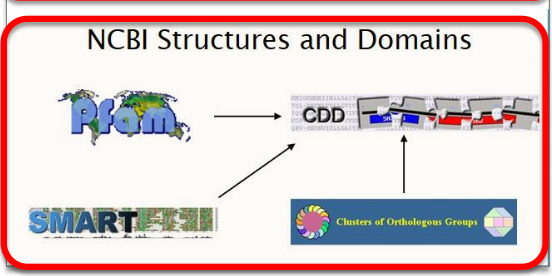

** GenBank
The GenBank sequence database is an open access, annotated collection of all publicly
available nucleotide sequences and their protein translations

*Submission*\\
- Only original sequences can be submitted to GenBank. Direct submissions are made to GenBank
  via a Web-based form, or the stand-alone submission program, Sequin.
- Upon receipt of a sequence submission, the GenBank staff examines the
  originality of the data and assigns an accession number to the sequence and
  performs quality assurance checks.
- The submissions are then released to the public database, where the entries
  are retrievable by Entrez or downloadable by FTP.

*** GenBank Record Sample
*Structure*
- Header
- Features
- Sequence

Most important *fields*:
- Accession code (eg. U49845): Stable, Reportable and Universal identifier
- Version : tracks changes in sequence
- CDS (Coding Sequence Region) : region of nucleotides that corresponds with the sequence of
  amino acids in a protein (includes start and stop codons). This field include also the
  respective translation protein. Annotation on the quality of the CDS can be
  present.(experimental/not experimental)

#+BEGIN_SRC
LOCUS       SCU49845     5028 bp    DNA             PLN       21-JUN-1999
DEFINITION  Saccharomyces cerevisiae TCP1-beta gene, partial cds, and Axl2p
            (AXL2) and Rev7p (REV7) genes, complete cds.
ACCESSION   U49845
VERSION     U49845.1  GI:1293613
KEYWORDS    .
SOURCE      Saccharomyces cerevisiae (baker's yeast)
  ORGANISM  Saccharomyces cerevisiae
            Eukaryota; Fungi; Ascomycota; Saccharomycotina; Saccharomycetes;
            Saccharomycetales; Saccharomycetaceae; Saccharomyces.
REFERENCE   1  (bases 1 to 5028)
  AUTHORS   Torpey,L.E., Gibbs,P.E., Nelson,J. and Lawrence,C.W.
  TITLE     Cloning and sequence of REV7, a gene whose function is required for
            DNA damage-induced mutagenesis in Saccharomyces cerevisiae
  JOURNAL   Yeast 10 (11), 1503-1509 (1994)
  PUBMED    7871890
REFERENCE   2  (bases 1 to 5028)
  AUTHORS   Roemer,T., Madden,K., Chang,J. and Snyder,M.
  TITLE     Selection of axial growth sites in yeast requires Axl2p, a novel
            plasma membrane glycoprotein
  JOURNAL   Genes Dev. 10 (7), 777-793 (1996)
  PUBMED    8846915
REFERENCE   3  (bases 1 to 5028)
  AUTHORS   Roemer,T.
  TITLE     Direct Submission
  JOURNAL   Submitted (22-FEB-1996) Terry Roemer, Biology, Yale University, New
            Haven, CT, USA
FEATURES             Location/Qualifiers
     source          1..5028
                     /organism="Saccharomyces cerevisiae"
                     /db_xref="taxon:4932"
                     /chromosome="IX"
                     /map="9"
     CDS             <1..206
                     /codon_start=3
                     /product="TCP1-beta"
                     /protein_id="AAA98665.1"
                     /db_xref="GI:1293614"
                     /translation="SSIYNGISTSGLDLNNGTIADMRQLGIVESYKLKRAVVSSASEA
                     AEVLLRVDNIIRARPRTANRQHM"
     gene            687..3158
                     /gene="AXL2"
     CDS             687..3158
                     /gene="AXL2"
                     /note="plasma membrane glycoprotein"
                     /codon_start=1
                     /function="required for axial budding pattern of S.
                     cerevisiae"
                     /product="Axl2p"
                     /protein_id="AAA98666.1"
                     /db_xref="GI:1293615"
                     /translation="MTQLQISLLLTATISLLHLVVATPYEAYPIGKQYPPVARVNESF
                     TFQISNDTYKSSVDKTAQITYNCFDLPSWLSFDSSSRTFSGEPSSDLLSDANTTLYFN
                     VILEGTDSADSTSLNNTYQFVVTNRPSISLSSDFNLLALLKNYGYTNGKNALKLDPNE
                     VFNVTFDRSMFTNEESIVSYYGRSQLYNAPLPNWLFFDSGELKFTGTAPVINSAIAPE
                     TSYSFVIIATDIEGFSAVEVEFELVIGAHQLTTSIQNSLIINVTDTGNVSYDLPLNYV
                     YLDDDPISSDKLGSINLLDAPDWVALDNATISGSVPDELLGKNSNPANFSVSIYDTYG
                     DVIYFNFEVVSTTDLFAISSLPNINATRGEWFSYYFLPSQFTDYVNTNVSLEFTNSSQ
                     DHDWVKFQSSNLTLAGEVPKNFDKLSLGLKANQGSQSQELYFNIIGMDSKITHSNHSA
                     NATSTRSSHHSTSTSSYTSSTYTAKISSTSAAATSSAPAALPAANKTSSHNKKAVAIA
                     CGVAIPLGVILVALICFLIFWRRRRENPDDENLPHAISGPDLNNPANKPNQENATPLN
                     NPFDDDASSYDDTSIARRLAALNTLKLDNHSATESDISSVDEKRDSLSGMNTYNDQFQ
                     SQSKEELLAKPPVQPPESPFFDPQNRSSSVYMDSEPAVNKSWRYTGNLSPVSDIVRDS
                     YGSQKTVDTEKLFDLEAPEKEKRTSRDVTMSSLDPWNSNISPSPVRKSVTPSPYNVTK
                     HRNRHLQNIQDSQSGKNGITPTTMSTSSSDDFVPVKDGENFCWVHSMEPDRRPSKKRL
                     VDFSNKSNVNVGQVKDIHGRIPEML"
     gene            complement(3300..4037)
                     /gene="REV7"
     CDS             complement(3300..4037)
                     /gene="REV7"
                     /codon_start=1
                     /product="Rev7p"
                     /protein_id="AAA98667.1"
                     /db_xref="GI:1293616"
                     /translation="MNRWVEKWLRVYLKCYINLILFYRNVYPPQSFDYTTYQSFNLPQ
                     FVPINRHPALIDYIEELILDVLSKLTHVYRFSICIINKKNDLCIEKYVLDFSELQHVD
                     KDDQIITETEVFDEFRSSLNSLIMHLEKLPKVNDDTITFEAVINAIELELGHKLDRNR
                     RVDSLEEKAEIERDSNWVKCQEDENLPDNNGFQPPKIKLTSLVGSDVGPLIIHQFSEK
                     LISGDDKILNGVYSQYEEGESIFGSLF"
ORIGIN
        1 gatcctccat atacaacggt atctccacct caggtttaga tctcaacaac ggaaccattg
       61 ccgacatgag acagttaggt atcgtcgaga gttacaagct aaaacgagca gtagtcagct
      121 ctgcatctga agccgctgaa gttctactaa gggtggataa catcatccgt gcaagaccaa
      181 gaaccgccaa tagacaacat atgtaacata tttaggatat acctcgaaaa taataaaccg
      241 ccacactgtc attattataa ttagaaacag aacgcaaaaa ttatccacta tataattcaa
      301 agacgcgaaa aaaaaagaac aacgcgtcat agaacttttg gcaattcgcg tcacaaataa
      361 attttggcaa cttatgtttc ctcttcgagc agtactcgag ccctgtctca agaatgtaat
      421 aatacccatc gtaggtatgg ttaaagatag catctccaca acctcaaagc tccttgccga
      481 gagtcgccct cctttgtcga gtaattttca cttttcatat gagaacttat tttcttattc
      541 tttactctca catcctgtag tgattgacac tgcaacagcc accatcacta gaagaacaga
      601 acaattactt aatagaaaaa ttatatcttc ctcgaaacga tttcctgctt ccaacatcta
      661 cgtatatcaa gaagcattca cttaccatga cacagcttca gatttcatta ttgctgacag
      721 ctactatatc actactccat ctagtagtgg ccacgcccta tgaggcatat cctatcggaa
      781 aacaataccc cccagtggca agagtcaatg aatcgtttac atttcaaatt tccaatgata
      841 cctataaatc gtctgtagac aagacagctc aaataacata caattgcttc gacttaccga
      901 gctggctttc gtttgactct agttctagaa cgttctcagg tgaaccttct tctgacttac
      961 tatctgatgc gaacaccacg ttgtatttca atgtaatact cgagggtacg gactctgccg
     1021 acagcacgtc tttgaacaat acataccaat ttgttgttac aaaccgtcca tccatctcgc
     1081 tatcgtcaga tttcaatcta ttggcgttgt taaaaaacta tggttatact aacggcaaaa
     1141 acgctctgaa actagatcct aatgaagtct tcaacgtgac ttttgaccgt tcaatgttca
     1201 ctaacgaaga atccattgtg tcgtattacg gacgttctca gttgtataat gcgccgttac
     1261 ccaattggct gttcttcgat tctggcgagt tgaagtttac tgggacggca ccggtgataa
     1321 actcggcgat tgctccagaa acaagctaca gttttgtcat catcgctaca gacattgaag
     1381 gattttctgc cgttgaggta gaattcgaat tagtcatcgg ggctcaccag ttaactacct
     1441 ctattcaaaa tagtttgata atcaacgtta ctgacacagg taacgtttca tatgacttac
     1501 ctctaaacta tgtttatctc gatgacgatc ctatttcttc tgataaattg ggttctataa
     1561 acttattgga tgctccagac tgggtggcat tagataatgc taccatttcc gggtctgtcc
     1621 cagatgaatt actcggtaag aactccaatc ctgccaattt ttctgtgtcc atttatgata
     1681 cttatggtga tgtgatttat ttcaacttcg aagttgtctc cacaacggat ttgtttgcca
     1741 ttagttctct tcccaatatt aacgctacaa ggggtgaatg gttctcctac tattttttgc
     1801 cttctcagtt tacagactac gtgaatacaa acgtttcatt agagtttact aattcaagcc
     1861 aagaccatga ctgggtgaaa ttccaatcat ctaatttaac attagctgga gaagtgccca
     1921 agaatttcga caagctttca ttaggtttga aagcgaacca aggttcacaa tctcaagagc
     1981 tatattttaa catcattggc atggattcaa agataactca ctcaaaccac agtgcgaatg
     2041 caacgtccac aagaagttct caccactcca cctcaacaag ttcttacaca tcttctactt
     2101 acactgcaaa aatttcttct acctccgctg ctgctacttc ttctgctcca gcagcgctgc
     2161 cagcagccaa taaaacttca tctcacaata aaaaagcagt agcaattgcg tgcggtgttg
     2221 ctatcccatt aggcgttatc ctagtagctc tcatttgctt cctaatattc tggagacgca
     2281 gaagggaaaa tccagacgat gaaaacttac cgcatgctat tagtggacct gatttgaata
     2341 atcctgcaaa taaaccaaat caagaaaacg ctacaccttt gaacaacccc tttgatgatg
     2401 atgcttcctc gtacgatgat acttcaatag caagaagatt ggctgctttg aacactttga
     2461 aattggataa ccactctgcc actgaatctg atatttccag cgtggatgaa aagagagatt
     2521 ctctatcagg tatgaataca tacaatgatc agttccaatc ccaaagtaaa gaagaattat
     2581 tagcaaaacc cccagtacag cctccagaga gcccgttctt tgacccacag aataggtctt
     2641 cttctgtgta tatggatagt gaaccagcag taaataaatc ctggcgatat actggcaacc
     2701 tgtcaccagt ctctgatatt gtcagagaca gttacggatc acaaaaaact gttgatacag
     2761 aaaaactttt cgatttagaa gcaccagaga aggaaaaacg tacgtcaagg gatgtcacta
     2821 tgtcttcact ggacccttgg aacagcaata ttagcccttc tcccgtaaga aaatcagtaa
     2881 caccatcacc atataacgta acgaagcatc gtaaccgcca cttacaaaat attcaagact
     2941 ctcaaagcgg taaaaacgga atcactccca caacaatgtc aacttcatct tctgacgatt
     3001 ttgttccggt taaagatggt gaaaattttt gctgggtcca tagcatggaa ccagacagaa
     3061 gaccaagtaa gaaaaggtta gtagattttt caaataagag taatgtcaat gttggtcaag
     3121 ttaaggacat tcacggacgc atcccagaaa tgctgtgatt atacgcaacg atattttgct
     3181 taattttatt ttcctgtttt attttttatt agtggtttac agatacccta tattttattt
     3241 agtttttata cttagagaca tttaatttta attccattct tcaaatttca tttttgcact
     3301 taaaacaaag atccaaaaat gctctcgccc tcttcatatt gagaatacac tccattcaaa
     3361 attttgtcgt caccgctgat taatttttca ctaaactgat gaataatcaa aggccccacg
     3421 tcagaaccga ctaaagaagt gagttttatt ttaggaggtt gaaaaccatt attgtctggt
     3481 aaattttcat cttcttgaca tttaacccag tttgaatccc tttcaatttc tgctttttcc
     3541 tccaaactat cgaccctcct gtttctgtcc aacttatgtc ctagttccaa ttcgatcgca
     3601 ttaataactg cttcaaatgt tattgtgtca tcgttgactt taggtaattt ctccaaatgc
     3661 ataatcaaac tatttaagga agatcggaat tcgtcgaaca cttcagtttc cgtaatgatc
     3721 tgatcgtctt tatccacatg ttgtaattca ctaaaatcta aaacgtattt ttcaatgcat
     3781 aaatcgttct ttttattaat aatgcagatg gaaaatctgt aaacgtgcgt taatttagaa
     3841 agaacatcca gtataagttc ttctatatag tcaattaaag caggatgcct attaatggga
     3901 acgaactgcg gcaagttgaa tgactggtaa gtagtgtagt cgaatgactg aggtgggtat
     3961 acatttctat aaaataaaat caaattaatg tagcatttta agtataccct cagccacttc
     4021 tctacccatc tattcataaa gctgacgcaa cgattactat tttttttttc ttcttggatc
     4081 tcagtcgtcg caaaaacgta taccttcttt ttccgacctt ttttttagct ttctggaaaa
     4141 gtttatatta gttaaacagg gtctagtctt agtgtgaaag ctagtggttt cgattgactg
     4201 atattaagaa agtggaaatt aaattagtag tgtagacgta tatgcatatg tatttctcgc
     4261 ctgtttatgt ttctacgtac ttttgattta tagcaagggg aaaagaaata catactattt
     4321 tttggtaaag gtgaaagcat aatgtaaaag ctagaataaa atggacgaaa taaagagagg
     4381 cttagttcat cttttttcca aaaagcaccc aatgataata actaaaatga aaaggatttg
     4441 ccatctgtca gcaacatcag ttgtgtgagc aataataaaa tcatcacctc cgttgccttt
     4501 agcgcgtttg tcgtttgtat cttccgtaat tttagtctta tcaatgggaa tcataaattt
     4561 tccaatgaat tagcaatttc gtccaattct ttttgagctt cttcatattt gctttggaat
     4621 tcttcgcact tcttttccca ttcatctctt tcttcttcca aagcaacgat ccttctaccc
     4681 atttgctcag agttcaaatc ggcctctttc agtttatcca ttgcttcctt cagtttggct
     4741 tcactgtctt ctagctgttg ttctagatcc tggtttttct tggtgtagtt ctcattatta
     4801 gatctcaagt tattggagtc ttcagccaat tgctttgtat cagacaattg actctctaac
     4861 ttctccactt cactgtcgag ttgctcgttt ttagcggaca aagatttaat ctcgttttct
     4921 ttttcagtgt tagattgctc taattctttg agctgttctc tcagctcctc atatttttct
     4981 tgccatgact cagattctaa ttttaagcta ttcaatttct ctttgatc
//
#+END_SRC

*** Search field restrictions
We can add the following field restrictions keywords when we search in GenBank

- *[Title]* : Definition line glyceraldehyde 3
  phosphate dehydrogenase[Title]
- *[Organism]* : NCBI's taxonomy mouse[organism];
  green plants[organism];
- *[Properties]*: molecule type, location, database source
  biomol_mrna[properties]; biomol_genomic[properties];
  gene_in_mitochondrion[properties]; srcdb pdb[properties]
- *[Filter]*: subsets of data, Entrez links
  all[filter]; nucleotide mapview[filter]; nucleotide omim[filter]

*** Division organization
Records are divided into two types of /divisions/

*12 Traditional Divisions*\\
- PRI Primate
- PLN Plant and Fungal
- BCT Bacterial and Archeal
- INV Invertebrate
- ROD Rodent
- VRL Viral
- VRT Other Vertebrate
- MAM Mammalian
- PHG Phage
- SYN Synthetic (cloning vectors)
- ENV Environmental Samples
- UNA Unannotated

_Features_ :
- Direct Submissions
- Accurate
- Well characterized

*BULK Divisions*\\
- EST Expressed Sequence Tag
- GSS Genome Survey Sequence
- HTG High Throughput Genomic
- STS Sequence Tagged Site
- HTC High Throughput cDNA
- PAT Patent

_Features_:
- Batch Submission
- Inaccurate
- Poorly characterized

** RefSeq
The Reference Sequence (RefSeq) database is an open access, annotated and curated
collection of publicly available nucleotide sequences (DNA, RNA) and their protein products.
This database is built by National Center for Biotechnology Information (NCBI), and, unlike
GenBank, _provides only a single record for each natural biological molecule_ (i.e. DNA, RNA or
protein) for major organisms ranging from viruses to bacteria to eukaryotes.

For each model organism, RefSeq aims to provide separate and linked records for the genomic
DNA, the gene transcripts, and the proteins arising from those transcripts. RefSeq is limited
to major organisms for which sufficient data are available (more than 66,000 distinct “named”
organisms as of September 2011), while GenBank includes sequences for any organism
submitted

*** Difference RefSeq vs GenBank

| Genbank                        | RefSeq                                              |
|--------------------------------+-----------------------------------------------------|
| Not Curated                    | Curated                                             |
| Author submits                 | NCBI creates from genbank data                      |
| Multiple Records for same loci | Single records for each molecule of major organisms |
| No limit of species            | Limited number of organisms                         |
| Akin to primary literature     | Akin to review articles                             |
|                                |                                                     |

#+DOWNLOADED: file:///home/codicef/Pictures/sw.png @ 2020-12-15 17:15:34
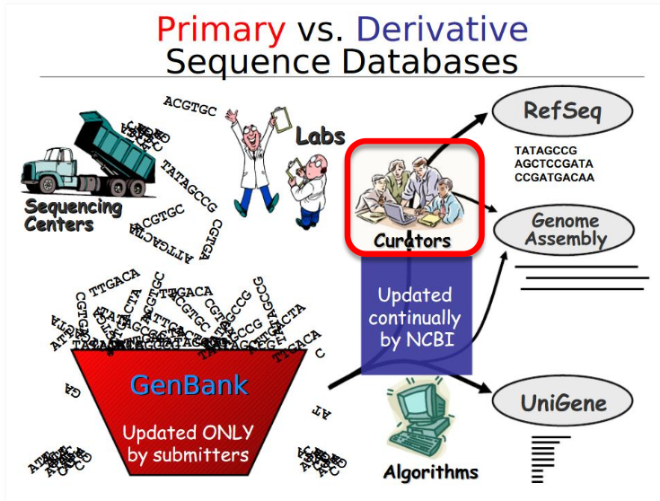

*** RefSeq Categories
| Category | Description                                     |
|----------+-------------------------------------------------|
| NC       | Complete genomic molecules                      |
| NG       | Incomplete genomic region                       |
| NM       | mRNA                                            |
| NR       | ncRNA                                           |
| NP       | Protein                                         |
| XM       | predicted mRNA model                            |
| XR       | predicted ncRNA model                           |
| XP       | predicted Protein model (eukaryotic sequences)  |
| WP       | predicted Protein model (prokaryotic sequences) |

*** RefSeq Status
- Model : No individual review
- Inferred : Predicted by genome sequence analysis
- Predicted : No individual review, some aspect predicted
- Reviewed : Reviewed by NCBI staff
- Validated : No final review, initial review performed

** Gene
Gene supplies gene-specific connections in the nexus of map, sequence,
expression, structure, function, citation, and homology data.

Unique identifiers are assigned to genes with defining sequences, genes with
known map positions, and genes inferred from phenotypic information. These gene
identifiers are used throughout NCBI's databases and tracked through updates of
annotation.

*** NCBI Record
A NCBI Gene record may include:
- nomenclature,
- Reference Sequences (RefSeqs),
- maps,
- pathways,
- variations,
- phenotypes,
- links to genome-, phenotype-, and locus-specific resources worldwide

*** NCBI Gene Query

#+attr_org: :width 650px
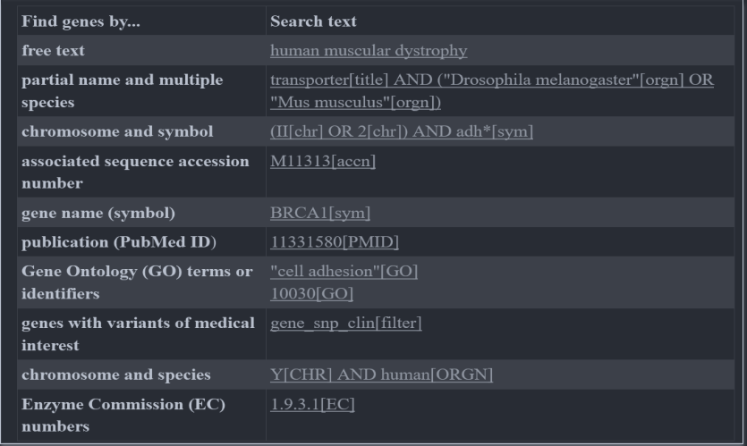

** OMIM (Online Mendelian Inheritance in Man)
The full-text overviews in OMIM contain information on all known
mendelian disorders and over 16,000 genes. It is updated daily.
- OMIM focuses on the relationship between phenotype and genotype.
- This database was initiated in the early 1960s by Dr. Victor A. McKusick as a
  catalog of mendelian traits and disorders (Mendelian Inheritance in Man –
  MIM). The online version, OMIM, was created in 1985 by a collaboration between
  the NLM and the Johns Hopkins University.

** dbSNP
The database contains actually a range of molecular variations:
1) SNPs
2) short deletion and insertion polymorphisms (indels/DIPs)
3) microsatellite markers or Short Tandem Repeats (STRs)
4) multinucleotide polymorphisms (MNPs)

*Dataflow*\\

#+attr_org: :width 750px
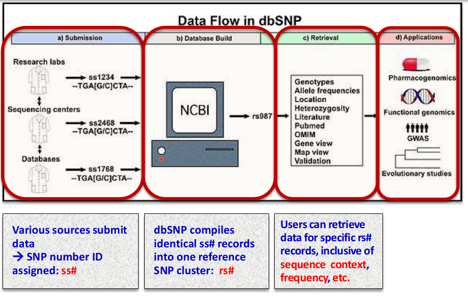

*** GWAS
Sequence variations might be responsible for individual phenotypic characteristics,
including a person's propensity toward complex disorders such as heart disease and cancer.

#+attr_org: :width 750px
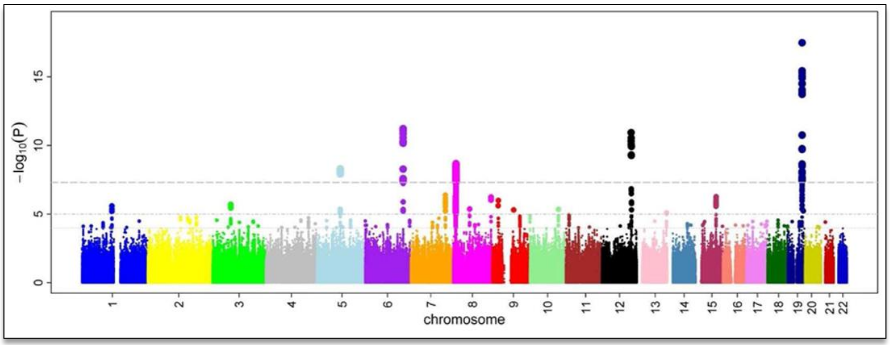

A Manhattan plot depicting several strongly associated risk loci. Each dot
represents a SNP, X-axis: genomic location, Y-axis: association level.

A GWA study investigating microcirculation, the tops indicates genetic variants that
more often are found in individuals with constrictions in small blood vessels.

** Nucleotide
The Nucleotide database is a collection of sequences from several sources,
including GenBank, RefSeq, TPA and PDB. Genome, gene and transcript sequence
data provide the foundation for biomedical research and discovery.

** Exercises
*** Exercise 1
- *Question*\\
In NCBI "Nucleotide", find all entries

containing:                  mRNA sequences

coding for:                   chymotrypsin and trypsin  (use the field: "Protein name")

from:                             all organisms except Plant, Fungal, and Viral

which have been:         reviewed or validated in RefSeq.

(Notice that in NCBI searches the boolean have to be uppercase :

"AND", "OR" , "NOT")

How many entries have you found ?

- *Answer*\\

  #+BEGIN_SRC
  "biomol mrna"[Properties] AND ("trypsin"[Protein Name] OR "chymotrypsin"[Protein Name]) NOT ("gbdiv pln"[Properties] OR "gbdiv vrl"[Properties]) AND ("srcdb refseq reviewed"[Properties] OR "srcdb refseq validated"[Properties])
  #+END_SRC

***  Exercise 2
  - *Question*\\
    In the Gene database, look for the gene coding for the NP_073728 protein.

    a) Which is its cytogenetic location ?

    b) In which biological process is the protein involved, according to the GO classification, TAS code ?

    c) What is the RefSeq Accession Number of the mRNA molecule coding for it?  Is it a reviewed entry?

  - *Answer*\\

    a) Location: 2q37.3
    b) circadian rhythm       GO:0007623
    c) NM_022817.3 Reviewed
*** Exercise 3
- *Question*
  a) How many genes in the «Gene» database have as source the species Homo sapiens ?
  b) How many of them are «protein coding» ?
  c) How many are «pseudo-genes» ?
  d) How many are «non-coding RNA» ?

- *Answer*
  a) 61745 - "human"[Organism]
  b) 19786 - ("human"[Organism]) AND "genetype protein coding"[Properties]
  c) 16552 - ("human"[Organism]) AND "genetype pseudo"[Properties]
  d) 17455 - ("genetype ncrna"[Properties]) AND "human"[Organism]

* Experimental Methods
** X-ray Crystallography
/X-ray crystallography/ (XRC) is the experimental science determining the atomic and molecular
structure of a crystal, in which the crystalline structure causes a beam of incident X-rays to
diffract into many specific directions. By measuring the angles and intensities of these
diffracted beams, a crystallographer can produce a three-dimensional picture of the density of
electrons within the crystal. From this electron density, the mean positions of the atoms in
the crystal can be determined, as well as their chemical bonds, their crystallographic
disorder, and various other information.

#+Xray Cristallography to structure scheme
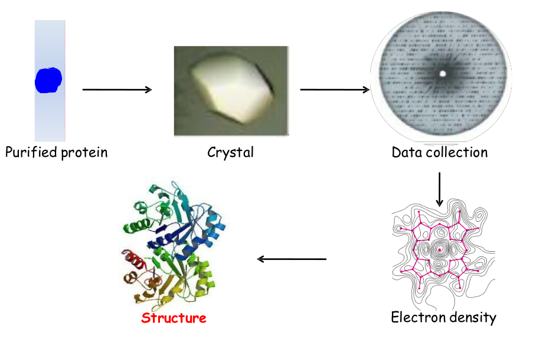

1. *Crystals Formation* : A crystal is a three-dimensional regular structure formed by many
   identical molecules. Proteins are large objects with irregular shapes and it is impossible
   to pack them into a crystal without forming large holes or channels between the individual
   molecules.

   The formation of a crystal strongly depends on a number of different parameters, such as
   pH, temperature, protein concentration. Well ordered protein crystals diffract X-rays.

   The atoms in a crystal are not static, but oscillate about their mean positions, usually by
   less than a few tenths of an angstrom. X-ray crystallography allows measuring the size of
   these oscillations.

   Due to the ordered molecular packing, the crystal behaves as a very powerful amplifier

2. *Why X-rays* : In order to measure something accurately you need the appropriate ruler. The
   X-rays wavelength[10 Å and 0.01 Å] has the same order of magnitude of a covalent bond. The
   type of X-rays used by crystallographers are ~ 0.5 to 1.5 Å long.

** NMR Spectroscopy
*Nuclear magnetic resonance spectroscopy*, most commonly known as NMR spectroscopy or magnetic
resonance spectroscopy (MRS), is a spectroscopic technique to observe local magnetic fields
around atomic nuclei.

- The sample is placed in a magnetic field and the NMR signal is produced by excitation of the
  nuclei sample with /radio waves/ into /nuclear magnetic resonance/, which is detected with
  sensitive radio receivers.
- The intramolecular magnetic field around an atom in a molecule changes the resonance
  frequency, thus giving access to details of the electronic structure of a molecule and its
  individual functional groups.

- A distinctive set of observed resonances may be analyzed to give a list of atomic nuclei
  that are close to one another, and to characterize the local conformation of atoms that are
  bonded together. This list of restraints is then used to build models of the protein that
  shows the location of each atom. The technique is currently limited to small or medium
  proteins, since large proteins present problems with overlapping peaks in the NMR spectra.

*Variation among models*\\
- can represent actual flexibility and thermal motion
- can mean uncertainty in the atomic positions

To distinguish between the two, specific NMR experiments can be used to measure the dynamics
of individual atoms.

*** Pros and Cons
*Difficulties*
- protein in solution: protein has to be soluble
- insensitive method: requires high concentrations of proteins
- direct determination of 3D structures for small proteins only
 (up to 50-60 kD)

*Advantages*
- protein in solution: no crystal packing artefacts, allows direct
binding experiments, hydrodynamic and folding studies
- assignment of mobile regions (loops) possible: no gaps in
structure

** Cry-electron microscopy
Electron microscopy, frequently referred to as 3DEM, is also used to determine 3D structures
of large macromolecular assemblies. A beam of electrons and a system of electron lenses is
used to image the biomolecule directly. Several tricks are required to obtain a 3D structure
from 2D projection images produced by transmission electron microscopes. The most commonly
used technique today involves imaging of many thousands of different single particles
preserved in a thin layer of non-crystalline ice (cryo-EM). Provided these views show the
molecule in myriad different orientations, a computational approach akin to that used for
computerized axial tomography or CAT scans in medicine will yield a 3D mass density map. With
a sufficient number of single particles, the 3DEM maps can then be interpreted by fitting an
atomic model of the macromolecule into the map, just as macromolecular crystallographers
interpret their electron density maps.

* Database
A database is an organized collection of data, generally stored and accessed electronically from a computer system.
